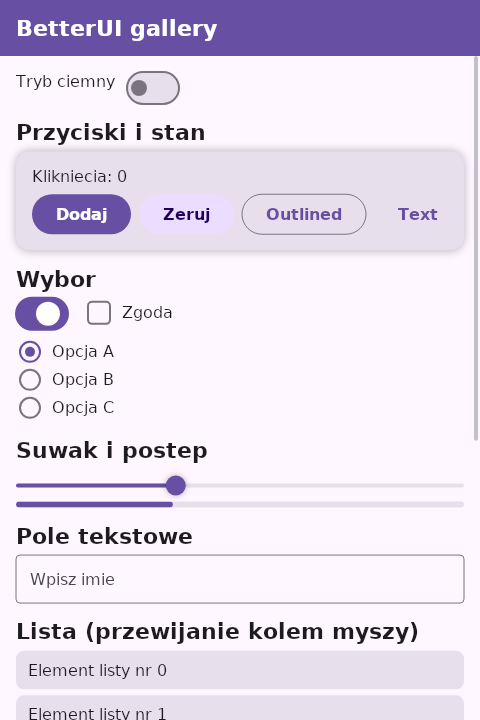

# BetterUI

Deklaratywne UI w stylu **Jetpack Compose** dla **Linuksa / x86_64**, napisane w **100% w HackerScript**
dla menedzera pakietow `bit`. Rysowanie: **Skia** (`skia-safe`, rasteryzacja CPU), okno i wejscie: X11/Wayland przez `minifb`.



## Szybki start

```
! Bit.hk aplikacji
[package]
-> name  => moja-apka
-> using => 0.5

[dependencies]
-> BetterUI => *
```

```
using <0.5>
get <bit:BetterUI>

fun App(ui: Ui) [
    let count = remember_int(ui, 0)
    Column(ui, modifier().fill_max_size().padding(24.0))
    let c = int_get(ui, count.clone())
    Headline(ui, "Licznik: " + (c as Str))
    if Button(ui, "+1") [
        int_set(ui, count.clone(), c + 1)
    ]
    EndColumn(ui)
]

fun main() [
    let gfx = window_open("Moja apka", 360, 240)
    let ui = ui_new(360.0, 240.0)
    while frame_begin(ui, gfx) [
        App(ui)
        frame_end(ui, gfx)
    ]
]
```

## Wymagania

* **Skompilowany `hackerc` z lataami z `patches/`** (bez nich Skia nie da sie wolac z HackerScript - patrz `patches/README.md`).
* Rust >= 1.85 (testowane: 1.91), Linux x86_64, X11 (lub XWayland), `libfontconfig1` + dowolny font systemowy (np. `fonts-dejavu-core`).
* `skia-safe` pobiera gotowe binaria Skii przy pierwszym buildzie (potrzebny dostep do github.com).

## Mapowanie Compose -> BetterUI

HackerScript **nie ma domkniec ani typow funkcyjnych**, wiec skladnia `Column { ... }` / `onClick = { ... }` jest niemozliwa.
Odpowiedniki:

| Jetpack Compose | BetterUI |
|---|---|
| `@Composable fun Foo()` | zwykla `fun Foo(ui: Ui)` |
| `Column(modifier) { ... }` | `Column(ui, m)` ... `EndColumn(ui)` (analogicznie `Row`, `Box`, `Card`, `Surface`, `ScrollColumn`) |
| `onClick = { ... }` | `if Button(ui, "OK") [ ... ]` (widgety zwracaja `Bool`) |
| `remember { mutableStateOf(0) }` | `remember_int/float/bool/str(ui, init)` + `int_get/int_set` itd. |
| `Modifier.padding(8.dp).fillMaxWidth()` | `modifier().padding(8.0).fill_max_width()` |
| `animateFloatAsState(x)` | `animate_float(ui, x)` |
| `key(i) { ... }` | `Key(ui, i)` przed wezlem |
| `MaterialTheme` | `ui_set_dark(ui, bool)`, `ui.theme` (`Theme`, `theme_light()`, `theme_dark()`) |

## API

**Kontenery:** `Column`, `ColumnWith(m, arrangement, align, spacing)`, `Row`, `RowWith`, `Box`, `BoxAlign`, `ScrollColumn`, `Card`, `Surface(m, color)`, `Clickable(m) -> Bool`, `Spacer`, `SpacerW`, `SpacerH`, `Divider`; zamykanie: `EndColumn/EndRow/EndBox/EndCard/EndSurface`.
Arrangement: `ARR_START|CENTER|END|SPACE_BETWEEN|SPACE_AROUND|SPACE_EVENLY`; alignment: `ALIGN_START|CENTER|END`, w `Box` 9 pozycji `ALIGN_TOP_START ... ALIGN_BOTTOM_END`. Waga: `modifier().weight(1.0)`.

**Tekst:** `Text`, `TextColored`, `TextStyled(size, color, bold)`, `Title`, `Headline`, `Label` (zawijanie wierszy po slowach).

**Widgety:** `Button`, `OutlinedButton`, `TextButton`, `TonalButton` (zwracaja `true` przy kliknieciu), `Checkbox(st, label)`, `RadioButton(st, index, label)`, `Switch(st)`, `Slider(st, lo, hi)` (przeciaganie), `LinearProgress(frac)`, `TextField(st, hint)` (kursor, Backspace/Delete/strzalki/Home/End), `TopAppBar(title)`.

**Modifier** (lancuch, kazda metoda zwraca nowy): `width height size min_size fill_max_width fill_max_height fill_max_size fill_width fill_height padding padding_xy padding_each weight background corner border shadow alpha offset clip clickable vertical_scroll key align`.

**Kolory:** `rgb(r,g,b)`, `argb(a,r,g,b)`, `color_lerp`, `color_with_alpha`, `color_scale_alpha` (Int `0xAARRGGBB`).

## Architektura

```
mod.hcs      punkt wejscia (get <bit:BetterUI>)        draw.hcs     kolory, Cmd (display list), Input
modifier.hcs Modifier                                  theme.hcs    Theme (Material 3 light/dark)
ui.hcs       kompozytor: drzewo wezlow, slot table (remember), animacje, interakcje (hot/active/focus)
layout.hcs   measure/place: Row/Column/Box, wagi, arrangement, zawijanie tekstu, scroll
paint.hcs    drzewo -> display list (cienie, ramki, clip, alfa)
widgets.hcs  widgety zlozone z prymitywow              app.hcs      frame_begin/frame_end, okno, headless
native.hcs   JEDYNY plik dotykajacy Skii/okna: render display list -> piksele Skii -> okno / PNG
```

Klatka: `frame_begin` (wejscie, hit-test na ukladzie z poprzedniej klatki) -> kompozycja (Twoja `App`) -> layout -> display list ->
render Skia tylko gdy display list sie zmienila -> prezentacja. Interakcje sa "immediate-mode" (jak w Dear ImGui), a stan trwa w slot table.

## Tryb headless (testy, zrzuty)

`headless_open(w, h)` + `frame_begin_with(ui, input)` pozwala symulowac mysz/klawiature i zapisac PNG (`native_save_png`).
Zobacz `tests/headless` (klikniecia, checkbox, pisanie w TextField).

## Ograniczenia (wersja 0.1)

* Okno ma stala wielkosc (brak reakcji na resize); brak IME - klawiatura US (litery, cyfry, podstawowa interpunkcja).
* Stan z `remember_*` nie jest sprzatany po zniknieciu wezlow (HackerScript nie iteruje po `Dict`).
* Klucze `Dict` musza byc `Str` (blad hackerc z `Dict<Int,..>`); wywolania `f(ui, g(ui))` rozbijaj na `let`.
* Brak: obrazow, ikon wektorowych, dialogow/popupow, listy z wirtualizacja (jest `ScrollColumn`), animacji sprezynowych.
* Backend Skia to rasteryzacja CPU (bez OpenGL/Vulkan).
